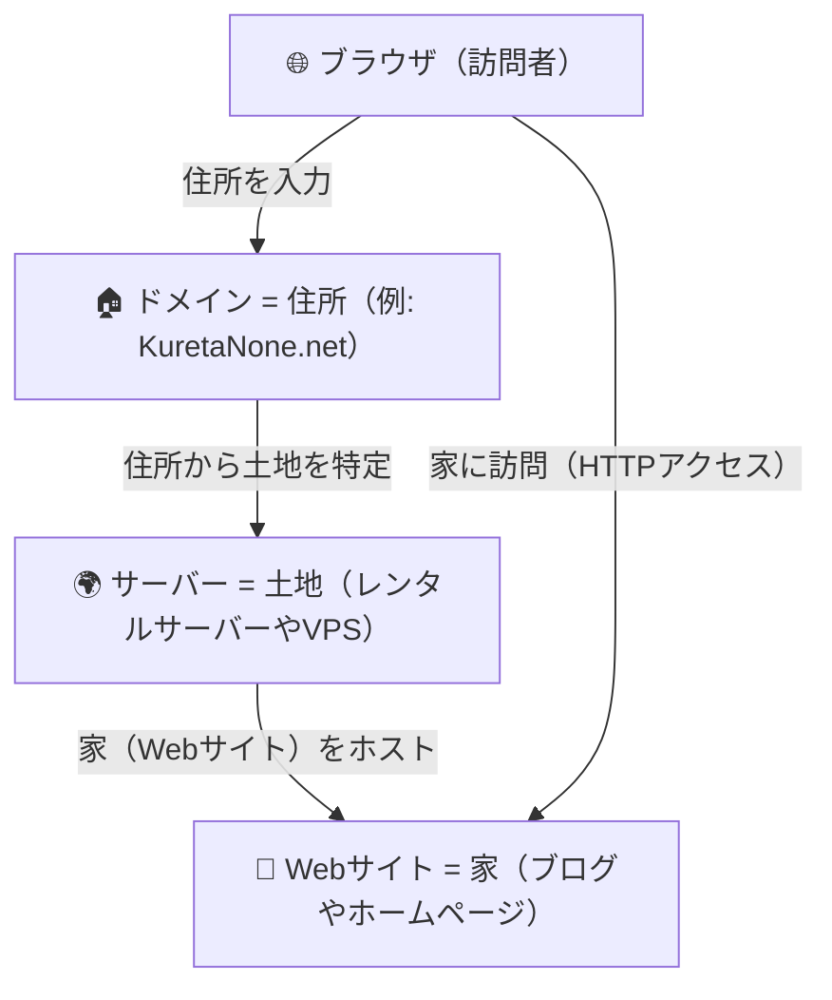

# 生き恥をさらす場所を作ろう

自分の生き恥をさらす場所としてKuretaNone.netを作成しました。

目的は以下のようなものを残すことです。

- 自分の趣味を残す場所
- 行動に対する記録
- 知識管理

有益なものは一切なく個人的な趣味やメモを残す場所として利用していきます。

## KuretaNone.netをネットに公開するまで

インターネットに自分の何かを公開するのは初めてのことだったので、KuretaNone.netができるまでの流れを簡単に記録します。

## はじめに

どうしたら、KuretaNone.netにアクセスできるようになるかを整理します。

### **サーバー**を用意する

インターネット上でサイトを公開するためには、[[サーバー]]が必要です。
これを見たい！と思った人がデータ取得するためにはデータが保存されている場所が必要です。
[[サーバー]]はその役割を果たしてくれます。

### **ドメイン**を取得する

サーバーに保存されたデータにアクセスすためには[[ドメイン]]が必要です。
`KuretaNone.net`というのは[[ドメイン]]名で、サーバーとドメインを紐づけると、インターネット上で`KuretaNone.net`にアクセスできるようになります。

### サーバーにデータをアップロードする

作成した[[HTML]]や[[CSS]],[[JavaScript]]のデータを[[サーバー]]にアップロードします。
このデータが、KuretaNone.netのコンテンツとなります。

## 実際にどうやるの？

今回は`KuretaNone.net`を作成するために行った手順をまとめます。

本当はここを見るよりも本家のサイトのマニュアルを確認したほうがわかりやすいとおもいますが。備忘録程度にここに記録。

### 1. XServerのアカウントを作成する

[[XServer]]は、[[サーバー]]を提供しているサービスの一つです。
[[XServer]]のアカウントを作成し、サーバーを契約します。

[アカウント画面](https://secure.xserver.ne.jp/xinfo/?action_reissue_index=true)にアクセスして、必要事項を記入にしてアカウント作成します。

### 2. サーバーを契約する。

アカウント作成後は、1週間は無料のお試し期間があります。
その後、契約を継続するかどうかを決めます。
本契約をする際は支払い形態を選択して、契約する月数分の料金を支払います。

> [!WARNING]
> 次の、**独自ドメイン永久無料特典**のキャンペーンを利用する際は12ヶ月以上の契約が必要です。

### 3. 独自ドメインを取得する

今回は、[独自ドメイン永久無料特典](https://www.xserver.ne.jp/manual/man_order_present_domain.php)を利用して、`KuretaNone.net`というドメインを取得しました。

> [!NOTE]
> から独自ドメイン永久無料特典の申し込みができる。

### 4. ドメインをサーバーに紐づける

ドメインを取得したら、次はそのドメインを[[サーバー]]に紐づけます。

サーバーの管理画面から、ドメイン設定を選択します。

### 5. サーバーにデータをアップロードする

サーバーのファイルマネージャーの画面から、**public_html**フォルダにサイトに表示したいデータをアップロードします。

### さいごに

アップロードしたファイルを[KuretaNone.net](https://kuretanone.net/)から閲覧できるようになりました。

たくさんのコンテンツを見てもらえるよう、定期的に更新をしていきます。
